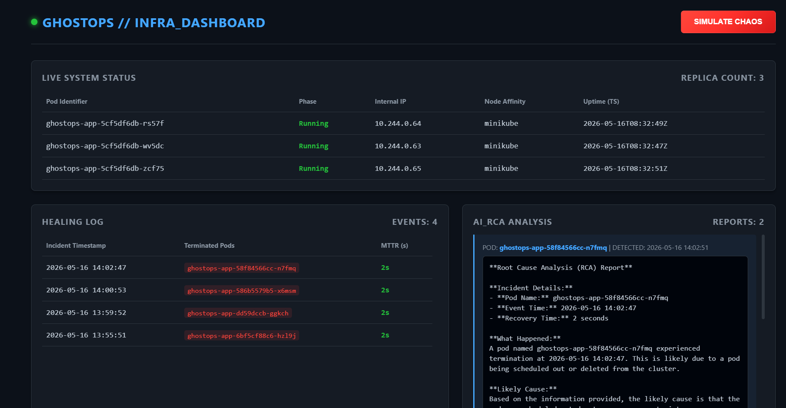
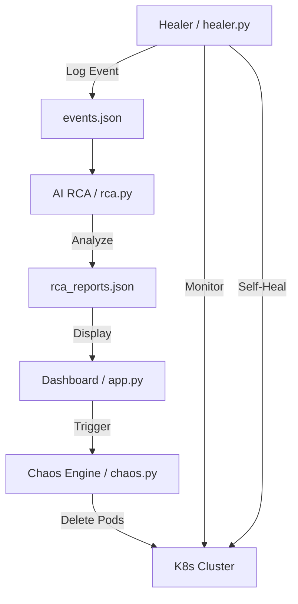

# 👻 GhostOps
**Autonomous Self-Healing Kubernetes Clusters with Chaos Engineering and AI-Powered RCA.**



---

## 🚀 What is GhostOps?
GhostOps is an intelligent DevOps experiment designed to bridge the gap between **Chaos Engineering** and **Autonomous Operations**. It creates a "Ghost in the Machine" that proactively breaks things (Chaos), detects failures instantly (Monitoring), heals the cluster (Self-Healing), and uses Large Language Models to perform Root Cause Analysis (AI RCA).

Unlike traditional monitoring systems, GhostOps doesn't just alert you—it fixes the problem and explains *why* it happened.

---

## 🏗️ Architecture
The system consists of four primary components working in a continuous loop:



1.  **`chaos.py`**: The disruptor. Randomly deletes pods to simulate infrastructure instability.
2.  **`healer.py`**: The guardian. Monitors the cluster and triggers automated rollout restarts when health checks fail.
3.  **`rca.py`**: The brain. Uses Groq (Llama 3.1) to analyze event logs and provide human-readable post-mortems.
4.  **`app.py`**: The interface. A Flask-based dashboard to visualize cluster health and trigger chaos events.

---

## 🛠️ Tech Stack
- **Orchestration**: Kubernetes (Minikube)
- **Containerization**: Docker
- **Backend**: Python 3.x, Flask
- **Intelligence**: Groq AI (Llama 3.1 70B)
- **CLI Tools**: `kubectl`

---

## 📋 Prerequisites
Ensure you have the following installed and configured:
- [Docker Desktop](https://www.docker.com/products/docker-desktop/)
- [Minikube](https://minikube.sigs.k8s.io/docs/start/)
- [Python 3.10+](https://www.python.org/downloads/)
- [Groq API Key](https://console.groq.com/)

---

## ⚙️ Setup & Installation

Follow these steps to get GhostOps running locally:

1.  **Clone the Repository**
    ```bash
    git clone https://github.com/your-username/ghostops.git
    cd ghostops
    ```

2.  **Configure Environment**
    Create a `.env` file in the root directory:
    ```env
    GROQ_API_KEY=your_actual_groq_api_key_here
    ```

3.  **Start Kubernetes Cluster**
    ```bash
    minikube start
    ```

4.  **Deploy Application to K8s**
    ```bash
    kubectl apply -f app.yaml
    ```

5.  **Run the Healer (Separate Terminal)**
    ```bash
    python healer.py
    ```

6.  **Run the Dashboard (Separate Terminal)**
    ```bash
    python app.py
    ```

7.  **Access the Dashboard**
    Open your browser and navigate to:
    [http://localhost:5000](http://localhost:5000)

---

## 🎮 Usage
- **Trigger Chaos**: Click the **"Trigger Chaos"** button on the dashboard or run `python chaos.py` manually.
- **Watch the Healing**: Observe the dashboard or run `kubectl get pods -w` to see pods being deleted and recreated.
- **Read the RCA**: After a healing event, check the **"RCA Reports"** section in the dashboard to see the AI's analysis of the failure.

---

> [!NOTE]
> This project currently operates within a local Minikube environment. External monitoring integrations like Prometheus, Grafana, or AWS CloudWatch are not included in the current version.
