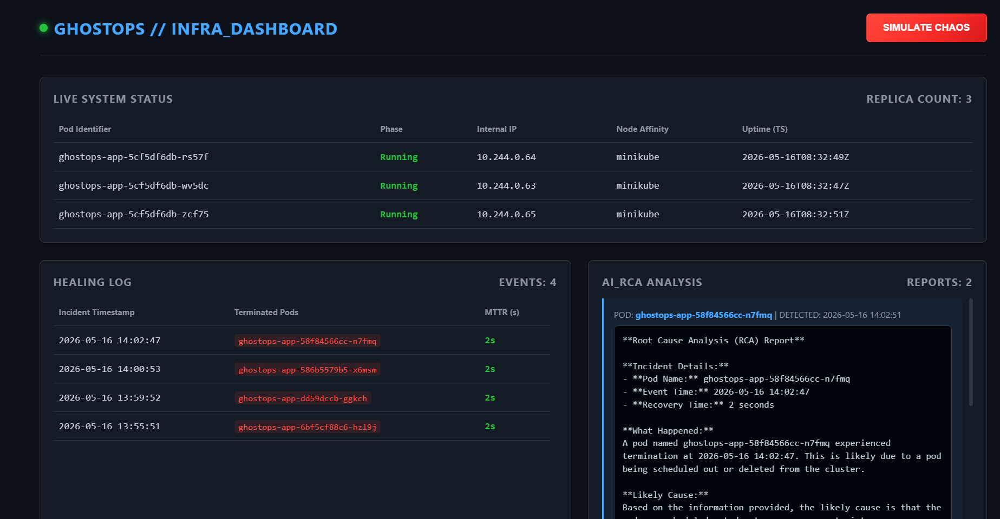

# 👻 GhostOps

**Production-Grade Autonomous Self-Healing Kubernetes Cluster with Chaos Engineering, OpenTelemetry Distributed Tracing, Loki Log Aggregation, and AI-Powered RCA.**



---

## 🚀 What is GhostOps?

GhostOps is an advanced DevSecOps demonstration bridging the gap between **Chaos Engineering**, **Observability (Three Pillars)**, and **Autonomous SRE Operations**. It builds a resilient system that:
1.  **Disrupts**: Triggers manual container terminations, CPU mathematical exhaustion, or memory leak attacks.
2.  **Observes**: Aggregates metrics (Prometheus/Grafana), logs (Loki/Promtail), and traces transaction flows (OpenTelemetry/Jaeger).
3.  **Remediates**: Executes defensive, time-windowed self-healing algorithms (targeting long-standing CrashLoops or image pull failures).
4.  **Diagnoses**: Leverages Large Language Models (Groq AI / Llama 3.1) to generate comprehensive Root Cause Analysis (RCA) post-mortems and broadcasts details instantly to an interactive WebSockets dashboard.

---

## 🏗️ Architecture

The system operates in a continuous telemetry-driven closed feedback loop:

```mermaid
graph TD
    subgraph Control Plane (Local Machine)
        A[Dashboard / app.py] <-->|WebSockets / Flask-SocketIO| B[UI / index.html]
        A -->|Triggers script| C[Chaos Engine / chaos.py]
        D[Healer / healer.py] -->|Query Pod States| E[Kubernetes Cluster]
        D -->|Log Structured JSON| F[healer_structured.log]
        D -->|Trigger| G[AI RCA / rca.py]
        G -->|Fetch Secret| E
        G -->|Log report| H[rca_reports.json]
    end

    subgraph Kubernetes Cluster (Minikube)
        E -->|Exposes 3 Replicas| I[Custom FastAPI App]
        I -->|Exposes| J[GET /metrics]
        I -->|Exposes| K[GET /health]
        I -->|Exposes| L[POST /chaos/cpu & memory]
        M[Promtail] -->|Scrapes stdout| I
        M -->|Aggregates| N[Loki]
        O[Prometheus] -->|Scrapes metrics| J
        P[Jaeger Query] <-->|OTLP Trace Spans| I
        P <-->|OTLP Trace Spans| D
        P <-->|OTLP Trace Spans| G
    end
    
    C -->|Creates Span & active_trace.json| D
    D -->|Propagates tracecontext| G
```

---

## 🛠️ Complete Tech Stack

*   **Orchestration**: Kubernetes (Minikube local sandbox)
*   **Target Core Application**: FastAPI (Python), Uvicorn
*   **Distributed Tracing**: OpenTelemetry SDK & Propagators, Jaeger
*   **Log Aggregation**: Grafana Loki & Promtail (kube-prometheus-stack)
*   **Metrics Scrape**: Prometheus Client (ASGI mounted), Grafana Visualizer
*   **AI Diagnostics**: Groq API (Llama 3.1 8B Model)
*   **Security Integration**: Kubernetes Opaque Secrets (GROQ_API_KEY)
*   **Web Console**: Flask, Flask-SocketIO (WebSockets), Simple-WebSocket

---

## 🔬 Core Components & Upgrades

### 1. Custom Python Application (`fastapi_app/`)
*   Replaced the baseline Nginx image with a customized FastAPI app in a 3-replica configuration.
*   Exposes `GET /health` mapped to Kubernetes **Liveness and Readiness probes**.
*   Exposes `GET /metrics` integrating `prometheus_client` to track custom metrics like CPU load, memory leakage, and request latency.
*   Exposes `/chaos/cpu` and `/chaos/memory` endpoints to simulate active environment resource attacks.

### 2. Distributed Telemetry Tracing (OpenTelemetry + Jaeger)
*   Fully instrumented with transaction tracking using **W3C Trace Context propagators**.
*   When chaos is triggered via the dashboard, `chaos.py` generates a parent `traceparent` context and exports it to `active_trace.json`.
*   `healer.py` extracts the context and tracks cluster degradation under a sub-span, propagating it downstream to `rca.py` to generate SRE diagnostics.
*   The entire asynchronous incident cycle (Chaos ➔ Heal ➔ AI RCA) registers in Jaeger as a single, connected transaction trace.

### 3. Log Aggregation (Loki + Promtail)
*   Helm-orchestrated Loki & Promtail scrape standard out logs from all cluster pods.
*   `healer.py` outputs all diagnostic logging in structured JSON format (`healer_structured.log`), making it ingestible for Grafana log dashboards.

### 4. Smart Self-Healing Logic
*   Eliminated the heavy, aggressive rollout resets that occurred on standard pod recreations (which Kubernetes self-heals natively).
*   **New Logic**: The Healer tracks individual pod states. If a container enters a degraded loop (`CrashLoopBackOff`, `ImagePullBackOff`, `ErrImagePull`, or excessive crashes) and persists for **more than 30 seconds**, it triggers a target Deployment rollout restart.
*   Normal pod deletions are gracefully logged as "healed natively" without cluster resets.

### 5. WebSockets UI (Flask-SocketIO)
*   Upgraded the dashboard from slow, flashing 8-second page refreshes to full event-driven WebSockets.
*   `healer.py` and `rca.py` stream events and AI diagnostics via API callbacks to the Flask server, which instantly broadcasts highlights to the browser using high-performance animations and zero-page flashes.

### 6. Kubernetes Secret Security fallback
*   Removed plaintext API keys from `.env` files. Keys are base64-encrypted inside a Kubernetes Opaque Secret (`ghostops-secrets`).
*   `rca.py` retrieves credentials directly from Kubernetes Secrets via secure `kubectl` query fallbacks when running locally.

---

## 📋 Prerequisites

*   [Docker Desktop](https://www.docker.com/products/docker-desktop/) (configured to run Linux containers)
*   [Minikube](https://minikube.sigs.k8s.io/docs/start/)
*   [Python 3.10+](https://www.python.org/downloads/)
*   [Helm 3.x](https://helm.sh/)
*   [Groq API Key](https://console.groq.com/)

---

## ⚙️ Automated Setup & Installation

Launch the complete infrastructure (Kubernetes cluster, containers, metrics, logging, tracing) with a single setup command:

1.  **Clone the Repository**
    ```bash
    git clone https://github.com/your-username/ghostops.git
    cd ghostops
    ```

2.  **Configure API Key**
    Create a `.env` file in the root directory:
    ```env
    GROQ_API_KEY=gsk_your_actual_groq_api_key_here
    ```

3.  **Execute Helm Orchestrator Setup Script**
    ```bash
    bash scripts/setup.sh
    ```
    This script starts Minikube, adds Helm charts, deploys Prometheus, Grafana, Loki, Promtail, and Jaeger, builds the FastAPI image inside the Minikube daemon, resolves base64 secrets, applies deployments, and spins up secure background port-forwards.

4.  **Start Control Room Loops**
    Open two separate terminals and start your local Python loops:
    *   **Terminal A (Dashboard Console)**:
        ```bash
        pip install -r requirements.txt
        python app.py
        ```
    *   **Terminal B (Autonomous Healer)**:
        ```bash
        python healer.py
        ```

5.  **Explore the Cluster UIs**
    Open your browser and navigate to:
    *   **GhostOps Dashboard**: [http://localhost:5000](http://localhost:5000)
    *   **Jaeger Distributed Tracing**: [http://localhost:16686](http://localhost:16686) (Search for service `ghostops-fastapi-app`)
    *   **Grafana Dashboards**: [http://localhost:3000](http://localhost:3000) (User: `admin` | Password: `admin`)
    *   **FastAPI K8s Host Endpoints**: `http://<minikube-ip>:30080` or `http://<minikube-ip>:30080/metrics`

---

## 🎮 Simulating Chaos & Tracing Recovery

1.  **Standard Chaos**: Click **"Simulate Chaos"** on the dashboard. The replacement pod is scheduled and enters `Running` instantly. The dashboard updates over WebSockets without a page reload. Healer logs: `Cluster healed natively`.
2.  **Degradation Chaos**: Simulating CrashLoops or resources spikes:
    *   Trigger Memory Leak: `curl -X POST http://<minikube-ip>:30080/chaos/memory?leak_mb=90`
    *   Observe resource limits triggering a container crash.
    *   Healer detects CrashLoop, starts the 30-second countdown, triggers rollout restart, and publishes a real-time AI RCA post-mortem.
3.  **Audit the Trace**: Open **Jaeger**, select `ghostops-chaos-engine`, and examine the linked spans showing the exact timeline from Pod Deletion down through the Healer monitoring loop and the final AI RCA compilation.
